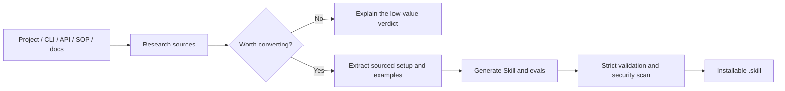

<h1 align="center">skill-builder</h1>

<p align="center"><strong>Turn projects into installable Codex Skills.</strong></p>

<p align="center">
  Analyze the source, extract real usage, generate, validate, and package the Skill.
</p>

<p align="center">
  <a href="README.md">简体中文</a> · <strong>English</strong> ·
  <a href="https://github.com/2025chunxi/skill-builder/releases/tag/v0.2.0-beta">Download v0.2.0-beta</a> ·
  <a href="https://github.com/2025chunxi/skill-builder/issues">Report an issue</a>
</p>

<p align="center">
  <a href="https://github.com/2025chunxi/skill-builder/actions/workflows/ci.yml"></a>
  <a href="https://github.com/2025chunxi/skill-builder/releases/tag/v0.2.0-beta"></a>
  <a href="LICENSE"></a>
  
</p>

## Why This Exists

Strong models can write a `SKILL.md`. That does not mean the result is worth building, grounded in the source, installable, or safe to publish. Common failures include:

- Wrapping generic prompting in a Skill folder without testing whether conversion adds value.
- Guessing setup commands and usage examples without retaining source locations.
- Generating a near-duplicate of an already installed Skill.
- Leaking local paths, credential-like values, or unverified examples into release artifacts.
- Producing plausible files without strict validation, regression tests, or a working `.skill` package.

`skill-builder` turns those failure points into a deterministic workflow and can explicitly recommend against low-value conversions.



## Tested on a Real Project

An open-source test against [`encode/httpx@b5addb6`](https://github.com/encode/httpx/tree/b5addb64f0161ff6bfe94c124ef76f6a1fba5254) produced:

| Check | Result |
|---|---:|
| Files inspected | 123 |
| Skill conversion value | **90/100, high** |
| README setup commands extracted | **3**, each with section and line evidence |
| README usage examples extracted | **1 `pycon` example**, with source location |
| Capabilities detected | Python package, CLI, docs, tests, environment-variable names |
| Privacy behavior | Local source-project and installed-Skill paths omitted by default |

> `90/100` is a transparent heuristic conversion score, not a truth oracle. Retained commands and examples still need execution testing before publishing the generated Skill.

## What You Get

A high-value conversion creates a reviewable Skill source tree:

```text
skill-src/
├── SKILL.md
├── agents/openai.yaml
├── evals/evals.json
└── references/project-analysis.json
```

| Capability | What it solves |
|---|---|
| Project inspector | Detects ecosystems, package names, CLIs, tests, docs, environment names, and README usage |
| Convertibility score | Tests whether the Skill adds durable knowledge, fragile procedure, or reusable assets |
| Duplicate detection | Checks installed Skills for overlapping trigger scope |
| Source-backed extraction | Retains file, section, and line evidence for setup commands and examples |
| Guided generation | Produces `SKILL.md`, UI metadata, evals, and project analysis |
| Strict delivery | Validates, regression-tests, security-scans, and packages a `.skill` archive |

## Install in 30 Seconds

### Option 1: Ask Codex to install it

Send this in Codex:

```text
Use $skill-installer to install:
https://github.com/2025chunxi/skill-builder/tree/main/skill/skill-builder
```

Start a new task, then try:

```text
Use $skill-builder to evaluate and convert path/to/project.
Decide whether it is worth turning into a Skill before generating, validating, and packaging it.
```

### Option 2: Download the release

Download [`skill-builder.skill`](https://github.com/2025chunxi/skill-builder/releases/download/v0.2.0-beta/skill-builder.skill), extract its top-level `skill-builder` directory into `$CODEX_HOME/skills` (default: `~/.codex/skills`), and start a new Codex task to load the Skill.

## Good Fits and Poor Fits

| Good candidate | Usually not worth a Skill |
|---|---|
| Stable API, CLI, SOP, template, or specialist method | Generic advice or ordinary prompting |
| Fragile sequence that is easy to repeat incorrectly | Mature models already perform it reliably without extra context |
| Project-specific commands, constraints, schemas, or assets | No reusable knowledge, script, or reference material |
| Deterministic validation, packaging, or privacy boundaries matter | Merely copying a README into `SKILL.md` |

## Build and Verify Locally

Requires Python 3.11+ and PyYAML 6.x:

```bash
python -m pip install -r requirements.txt
python scripts/build_release.py
```

The output is `dist/skill-builder.skill`. The build runs README extraction tests, security regression tests, strict Skill validation, archive integrity checks, and repository-wide scans for secrets, PII, local paths, and unsafe archives.

## Privacy and Evidence Boundaries

- Generated artifacts omit absolute source-project and installed-Skill paths by default.
- Credential-like values are redacted; only environment-variable names are retained.
- `--include-local-paths` is for private local diagnostics and should not enter public artifacts.
- README extraction proves provenance, not successful execution.
- Conversion scoring supports judgment; release still requires realistic trigger tests and human review.

## Project Status

The current release is `v0.2.0-beta`. This release adopts the new Skill name `skill-builder`; deterministic inspection, validation, and packaging paths are covered by automated tests.

Open an [Issue](https://github.com/2025chunxi/skill-builder/issues) or read [CONTRIBUTING.md](CONTRIBUTING.md) to contribute.

## License

[MIT](LICENSE)
