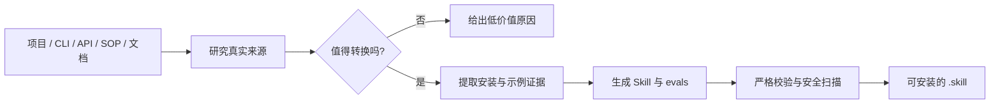

<h1 align="center">skill-builder</h1>

<p align="center"><strong>把项目变成可安装的 Codex Skill。</strong></p>

<p align="center">
  自动分析项目、提取真实用法、生成、验证并打包 Skill。
</p>

<p align="center">
  <strong>简体中文</strong> · <a href="README.en.md">English</a> ·
  <a href="https://github.com/2025chunxi/skill-builder/releases/tag/v0.2.0-beta">下载 v0.2.0-beta</a> ·
  <a href="https://github.com/2025chunxi/skill-builder/issues">反馈问题</a>
</p>

<p align="center">
  <a href="https://github.com/2025chunxi/skill-builder/actions/workflows/ci.yml"></a>
  <a href="https://github.com/2025chunxi/skill-builder/releases/tag/v0.2.0-beta"></a>
  <a href="LICENSE"></a>
  
</p>

## 为什么需要它

成熟模型会写 `SKILL.md`，但“能写”不等于“值得做、写得准、装得上”。真正容易出错的是：

- 没先判断项目是否值得转成 Skill，只是给通用提示词套了一层目录。
- 安装命令和使用示例靠猜，没有保留 README 行号和来源证据。
- 忽略本机已有 Skill，生成触发范围高度重叠的重复能力。
- 把本机绝对路径、疑似凭据或未验证示例带进发布包。
- 文件看起来齐全，却没有严格校验、回归测试和可安装的 `.skill`。

`skill-builder` 把这些环节变成确定性流程，并且允许在低价值时直接得出“不建议转换”。



## 真实跑过，不是概念 Demo

使用 [`encode/httpx@b5addb6`](https://github.com/encode/httpx/tree/b5addb64f0161ff6bfe94c124ef76f6a1fba5254) 做公开项目测试，结果如下：

| 检查项 | 实际结果 |
|---|---:|
| 扫描文件 | 123 |
| Skill 转化价值 | **90/100，high** |
| 从 README 提取安装命令 | **3 条**，均保留章节与行号 |
| 从 README 提取使用示例 | **1 个 `pycon` 示例**，保留来源位置 |
| 项目能力识别 | Python 包、CLI、文档、测试、环境变量名 |
| 隐私处理 | 默认省略源项目与已安装 Skill 的本机绝对路径 |

> `90/100` 是透明的启发式转化价值分，不是真理判定。发布生成的 Skill 前，仍应实际运行保留的命令和示例。

## 你会得到什么

对一个高价值项目执行转换后，会生成一套可继续审阅和测试的 Skill 源码：

```text
skill-src/
├── SKILL.md
├── agents/openai.yaml
├── evals/evals.json
└── references/project-analysis.json
```

核心能力包括：

| 能力 | 解决的问题 |
|---|---|
| 项目检查器 | 识别生态、包名、CLI、测试、文档、环境变量和 README 用法 |
| 转化价值评分 | 判断 Skill 是否增加了持久知识、脆弱流程或可复用资产 |
| 重复 Skill 检测 | 避免和本机已有 Skill 产生高相似触发范围 |
| 来源化提取 | 安装命令与示例保留文件、章节和行号 |
| Skill 引导生成 | 生成 `SKILL.md`、UI 元数据、eval 和项目分析 |
| 严格交付 | 运行校验、回归测试、安全扫描并打包 `.skill` |

## 30 秒安装

### 方式一：让 Codex 安装

在 Codex 中发送：

```text
使用 $skill-installer 安装：
https://github.com/2025chunxi/skill-builder/tree/main/skill/skill-builder
```

新建任务后即可这样使用：

```text
使用 $skill-builder 评估并转换 path/to/project。
先判断它是否值得做成 Skill，再生成、验证并打包结果。
```

### 方式二：下载发布包

下载 [`skill-builder.skill`](https://github.com/2025chunxi/skill-builder/releases/download/v0.2.0-beta/skill-builder.skill)，将归档中的 `skill-builder` 顶层目录解压到 `$CODEX_HOME/skills`（默认 `~/.codex/skills`），然后新建 Codex 任务以加载 Skill。

## 适合与不适合

| 适合转换 | 通常不值得转换 |
|---|---|
| 有稳定 API、CLI、SOP、模板或专业方法论 | 只有通用建议和普通提示词 |
| 流程顺序脆弱，重复执行容易出错 | 成熟模型无需额外上下文就能稳定完成 |
| 有项目特定命令、约束、Schema 或资产 | 没有可复用知识、脚本或参考资料 |
| 需要确定性校验、打包或隐私边界 | 只是把原 README 大段搬进 `SKILL.md` |

## 本地构建与验证

要求 Python 3.11+ 和 PyYAML 6.x：

```bash
python -m pip install -r requirements.txt
python scripts/build_release.py
```

输出为 `dist/skill-builder.skill`。构建会执行 README 提取测试、安全回归测试、严格 Skill 校验、归档完整性检查，以及仓库级密钥、PII、本机路径和归档安全扫描。

## 隐私与证据边界

- 生成物默认不包含源项目或已安装 Skill 的绝对路径。
- 疑似凭据值会被脱敏；环境变量只记录名称。
- `--include-local-paths` 仅适合私有本地诊断，不应进入公开产物。
- README 提取代表“有来源”，不代表命令已经执行验证。
- 转化评分用于辅助判断，最终发布仍需要真实触发测试和人工审阅。

## 项目状态

当前版本为 `v0.2.0-beta`。本版本启用新的 Skill 名称 `skill-builder`；确定性检查、校验和打包流程已有自动化测试。

欢迎提交 [Issue](https://github.com/2025chunxi/skill-builder/issues) 或阅读 [CONTRIBUTING.md](CONTRIBUTING.md) 参与改进。

## 许可证

[MIT](LICENSE)
